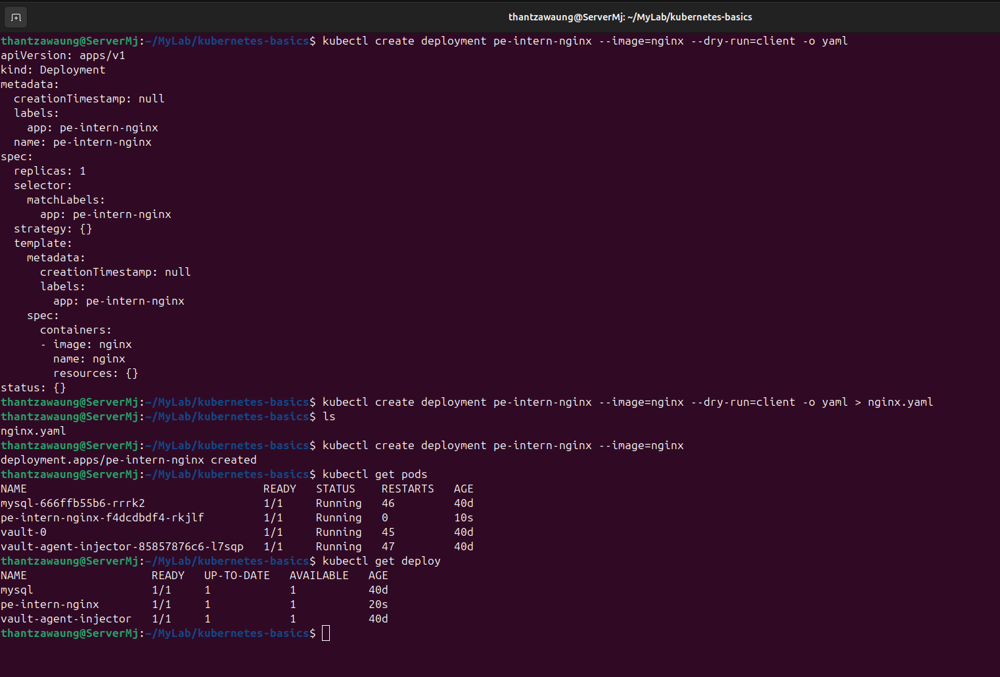

# Kubernetes Basics – Deploy and Verify Service Connectivity

---

## Goal

Gain hands-on experience with Kubernetes by:
- Deploying a simple nginx application
- Exposing it using a Kubernetes Service
- Verifying internal cluster connectivity
- Understanding basic Kubernetes networking concepts

---

## Scope

This lab covers:
- Deployment of nginx application
- Exposure using ClusterIP Service
- Internal connectivity testing using a temporary pod
- Inspection of Kubernetes resources (Pods, Services, Endpoints)
- Understanding traffic flow inside Kubernetes cluster

---

# 1. Deploy Nginx Application

A Deployment is created using the nginx image. The --dry-run=client -o yaml command is used to see the Kubernetes YAML without actually creating anything in the cluster. It helps understand how a Deployment is written.

For learning and quick testing, direct commands are useful. But in real projects, YAML files are better because they can be saved, reused, and managed properly in version control.



---

# 2. Expose Service

The Deployment is exposed using a ClusterIP Service.


---

# 3. Test Connectivity

A temporary busybox pod is used to test internal access.


---

# 4. Inspect Resources


---

# Traffic Flow in Kubernetes

```text
busybox Pod
    ↓
DNS: pe-intern-nginx
    ↓
ClusterIP Service
    ↓
Endpoints (Pod IP)
    ↓
nginx Pod
    ↓
HTTP Response
```

---

# Pod

A Pod is the smallest unit in Kubernetes that:

*  Runs a container (nginx)
*  Has its own IP address
*  Executes the actual application workload

---

# Service

A Service provides:

* Stable access to Pods
* Load balancing across Pods
* DNS-based internal connectivity

---

# ClusterIP

ClusterIP is:

* Default Service type
* Provides internal-only access within the cluster
* Not accessible from outside the cluster

---

# Deployment

A Deployment is a Kubernetes object that:

*  Manages and runs multiple Pods of an application (e.g., nginx)
*  Ensures the desired number of Pods are always running
*  Automatically replaces failed Pods
*  Supports scaling and rolling updates of applications

---


