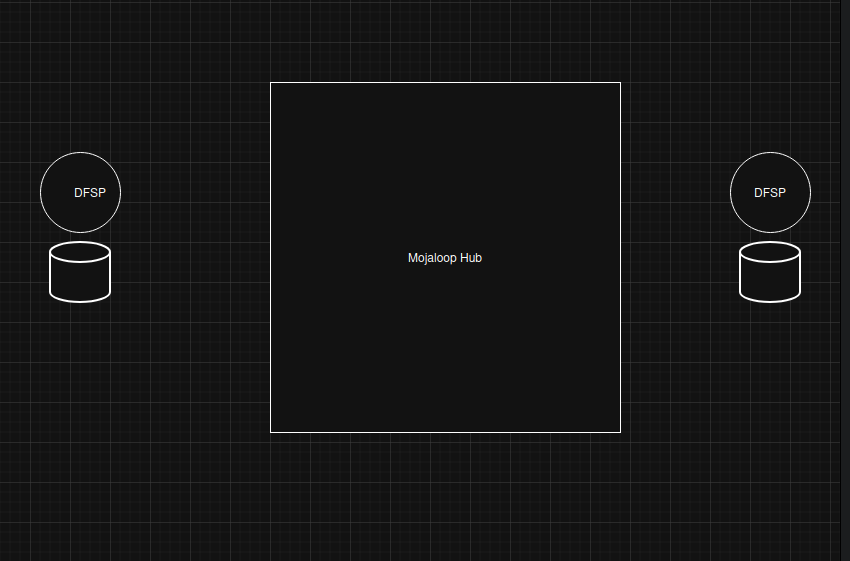

# Mojaloop Architecture

## Overview

This project explains the fundamental architecture of Mojaloop, focusing on the Mojaloop Hub, Payment Manager (PM4ML), and the high-level transaction flow between Digital Financial Service Providers (DFSPs).

Mojaloop enables interoperable digital payments using a hub-and-spoke model, allowing different financial systems to communicate through a central hub.

---

## Architecture Diagram



## Architecture Diagram

```text
Payer
  ↓
DFSP (Payer)
  ↓
SDK Adapter
  ↓
PM4ML
  ↓
==========================
     Mojaloop Hub
--------------------------
- API Layer (FSPIOP)
- Account Lookup (ALS)
- Quotes Service
- Transfers Service
- Central Ledger
- Settlement Service
==========================
  ↓
PM4ML
  ↓
SDK Adapter
  ↓
DFSP (Payee)
  ↓
Payee
```

---
1. GET /parties
2. POST /quotes
3. PUT /transfers

        ↓

[ Mojaloop Hub ]
   ├── Prepare Handler (validation)
   ├── Position Handler (balance check)
   └── Central Ledger (record money)

        ↓

4. PUT /fulfil

## Components

### Payer & Payee

End users who send and receive money.

---

### DFSP (Digital Financial Service Provider)

Financial institutions such as banks or mobile wallets.

* Payer DFSP → initiates transaction
* Payee DFSP → receives transaction

---

### SDK Adapter

Acts as a translator between DFSP systems and Mojaloop APIs.

* Converts DFSP API → Mojaloop FSPIOP API
* Converts responses back to DFSP format

---

### PM4ML (Payment Manager for Mojaloop)

A reference Mojaloop adapter that connects DFSPs to the Mojaloop Hub.

Includes:

* Core Connector → handles communication with Hub
* SDK Adapter → handles API translation

---

### Mojaloop Hub

The central system that manages and routes transactions.

Key services:

* Account Lookup Service (ALS) → identifies payee DFSP
* Quotes Service → validates transaction (fees, limits)
* Transfers Service → executes payment
* Central Ledger → tracks DFSP balances in real time
* Settlement Service → handles net settlement between DFSPs

---

## High-Level Transaction Flow

### Step-by-Step Process

1. **Payment Initiation**

   * Payer sends money using their DFSP application

2. **Request to PM4ML**

   * Payer DFSP sends request via SDK Adapter to PM4ML

3. **Account Lookup (ALS)**

   * Mojaloop Hub identifies which DFSP owns the payee

4. **Quote Phase**

   * Quotes service calculates fees and validates the transaction
   * Payee DFSP confirms it can receive funds

5. **Transfer Phase**

   * Transfers service executes the transaction
   * Funds are reserved and committed

6. **Central Ledger Update**

   * DFSP balances are updated in real time

7. **Notification**

   * Both payer and payee DFSPs receive confirmation

8. **Settlement**

   * Net positions between DFSPs are settled later (outside Mojaloop)

---

## Key Concepts

---

### Central Ledger

Tracks the real-time balance of each DFSP within Mojaloop.

---

### Settlement

Handles net reconciliation between DFSPs after transactions are completed.

---

### PM4ML as Adapter

PM4ML is a reference implementation of a Mojaloop adapter that simplifies DFSP integration.

---

## Conclusion

Mojaloop provides a scalable and interoperable payment system by using a centralized hub and standardized adapters like PM4ML. It ensures secure, real-time transaction processing while enabling efficient settlement between financial institutions.
